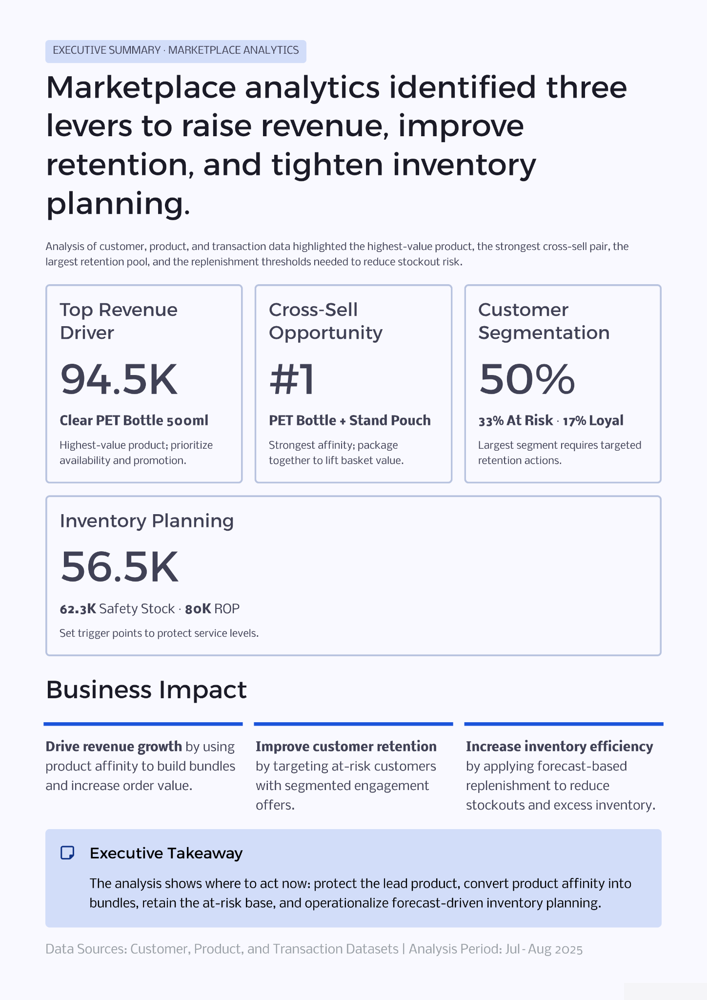
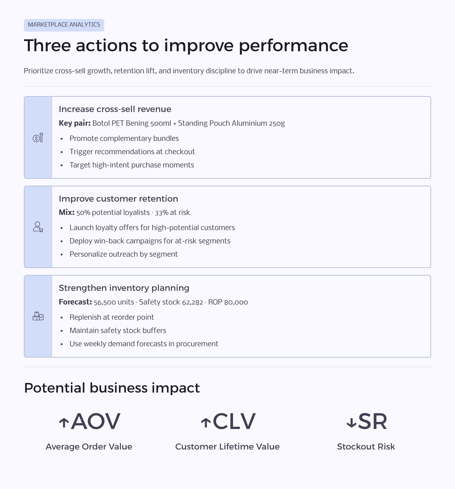
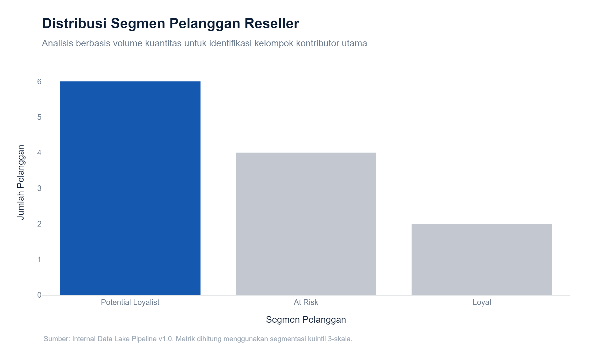
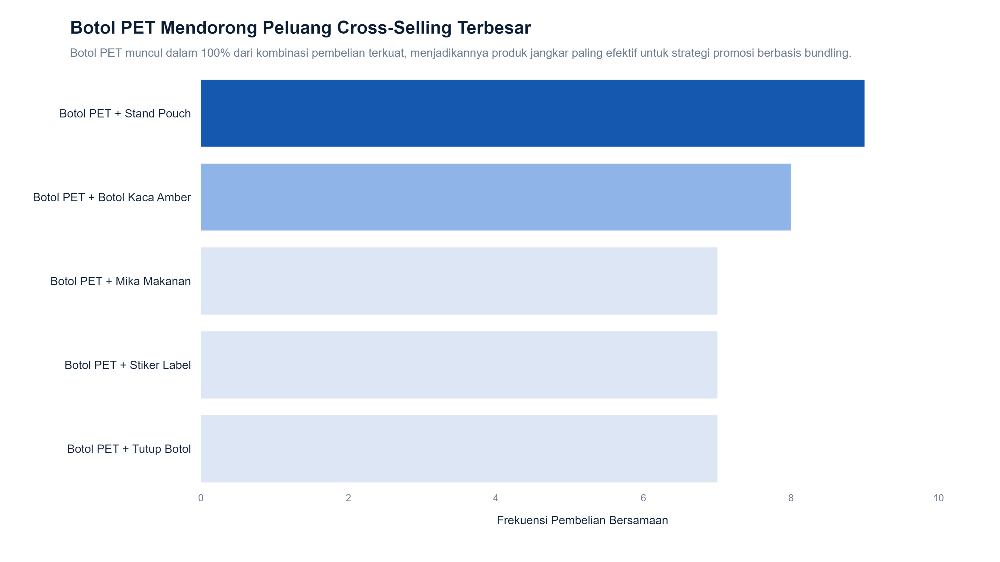
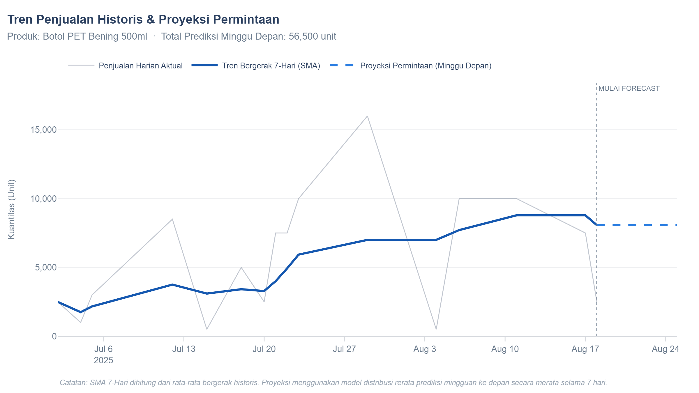

# Marketplace Analytics: Customer Segmentation, Market Basket Analysis, and Inventory Forecasting


An end-to-end analytics project that uses marketplace transaction data to identify cross-selling opportunities, segment customers by purchasing behavior, and forecast product demand for inventory planning. By combining data cleaning, Market Basket Analysis, RFM customer segmentation, and demand forecasting, the project generates business insights and operational recommendations that help marketplace resellers improve sales performance, customer retention, and inventory management.

---

# 📌 Portfolio Assets

This repository includes both the technical implementation and business-facing deliverables commonly used in consulting and business analytics engagements.

| Asset                       | Description                                                                                                   |
| --------------------------- | ------------------------------------------------------------------------------------------------------------- |
| 📄 Full Consulting Deck     | Executive presentation summarizing business context, analysis, findings, recommendations, and business impact |
| 📊 Executive Summary        | One-slide overview of the project's key findings and business insights                                        |
| 💡 Business Recommendations | Consulting-style recommendation framework connecting findings, actions, and expected impact                   |
| 📓 Jupyter Notebooks        | End-to-end analytical workflow and implementation                                                             |

---

## 📊 Executive Summary Preview



---

## 💡 Business Recommendations Preview



---

## 📄 Full Consulting Deck

A consulting-style presentation designed for business stakeholders, hiring managers, recruiters, and portfolio reviewers.

**Download Presentation**

```text
presentation/marketplace_analytics_consulting_deck.pdf
```

---

## 📌 Executive Summary

This project transforms marketplace transaction data into business insights that help independent resellers identify cross-selling opportunities, prioritize customer retention efforts, and improve inventory planning decisions.

### Key Outcomes

* Identified high-potential product bundles through Market Basket Analysis.
* Segmented customers into actionable groups using RFM analysis.
* Forecasted short-term product demand using historical sales trends.
* Calculated inventory planning metrics including Safety Stock and Reorder Point (ROP).

---

## 📊 Business Problem

Independent resellers operating in B2B marketplaces often make business decisions with limited visibility into customer purchasing patterns and product demand. This can lead to several challenges:

* Missed cross-selling opportunities due to limited understanding of which products are frequently purchased together.
* Inefficient marketing efforts caused by the lack of customer segmentation and prioritization.
* Inventory shortages or excess stock resulting from inaccurate demand planning.

This project addresses these challenges by transforming raw marketplace transaction data into data-driven recommendations that support sales growth and inventory optimization.

---

## 📋 Dataset Overview

The project uses three datasets representing customers, products, and marketplace transactions from a packaging-products marketplace ecosystem.

| Dataset              | Description                                                                                            |
| -------------------- | ------------------------------------------------------------------------------------------------------ |
| `data_pelanggan.csv` | Customer profiles, purchase frequency, purchase recency, and customer feedback                         |
| `data_produk.csv`    | Product catalog information including categories, pricing, and inventory levels                        |
| `data_transaksi.csv` | Historical transaction records containing orders, products purchased, quantities, revenue, and margins |

### Example Business Entities

#### Customers

* PT Makanan Sehat
* CV Minuman Segar
* UMKM Dapur Bunda
* Kopi Kita Bersama

#### Products

* Botol PET Bening 500ml
* Standing Pouch Aluminium 250g
* Karton Box Die Cut
* Tray Makanan Mika

These datasets enable customer analytics, product affinity analysis, demand forecasting, and inventory planning.

---

## 🎯 Project Objectives

### 1. Identify Cross-Selling Opportunities

Analyze purchasing behavior to discover products that are frequently bought together and can be bundled to increase average order value.

### 2. Segment Customers Based on Purchase Behavior

Use RFM-style customer analysis to identify loyal customers, high-potential customers, and customers at risk of churn.

### 3. Improve Inventory Planning

Forecast future demand and calculate inventory control metrics such as safety stock and reorder points to support more informed replenishment decisions.

---

## 🔄 Project Workflow

```text
        Raw Marketplace Data
                 │
                 ▼
    Data Cleaning & Validation
                 │
                 ▼
         Processed Datasets
       ┌─────────┼─────────┐
       ▼         ▼         ▼
    Market    Customer   Demand
    Basket    Segment   Forecast
   Analysis    (RFM)
       └─────────┬─────────┘
                 │
                 ▼
        Business Insights &
    Operational Recommendations
```

---

## 📂 Repository Structure

```text
data/
├── processed/
│   ├── cleaned_data_pelanggan.csv
│   ├── cleaned_data_produk.csv
│   └── cleaned_data_transaksi.csv
└── raw/
    ├── data_pelanggan.csv
    ├── data_produk.csv
    └── data_transaksi.csv

notebooks/
├── 01_data_exploration_and_cleaning.ipynb
├── 02_market_basket_analysis.ipynb
├── 03_customer_segmentation_rfm.ipynb
└── 04_demand_forecasting.ipynb

outputs/
├── charts/
│   ├── cross_sell_opportunity_analysis.png
│   ├── customer_segments_distribution.png
│   └── sales_trend_and_forecast.png
└── tables/
    ├── customer_segmentation_rfm.csv
    ├── inventory_forecasting_summary.csv
    └── top_product_pairs.csv

assets/
├── executive_summary.png
└── business_recommendations.png

presentation/
└── marketplace_analytics_consulting_deck.pdf

README.md
requirements.txt
```

---

## 🛠️ Data Pipeline & Analytics Methodology

### 1. Data Exploration & Cleaning (`01_data_exploration_and_cleaning.ipynb`)

* Validated data quality and schema consistency.
* Handled missing and inconsistent values.
* Standardized customer, product, and transaction records.
* Produced clean datasets for downstream analytics.

### 2. Market Basket Analysis (`02_market_basket_analysis.ipynb`)

**Key Findings**

* Botol PET Bening 500ml appeared consistently across the strongest product combinations.
* Botol PET + Stand Pouch achieved the highest co-purchase frequency.
* Results identified potential bundle recommendations to increase cross-selling opportunities.

### 3. Customer Segmentation (`03_customer_segmentation_rfm.ipynb`)

**Key Findings**

* Potential Loyalists (50%)
* At Risk (33%)
* Loyal Customers (17%)

### 4. Demand Forecasting & Inventory Optimization (`04_demand_forecasting.ipynb`)

**Key Findings**

* Forecasted Demand: 56,500 units
* Safety Stock: 62,282 units
* Reorder Point (ROP): 80,000 units

---

## 📈 Key Results

| Analysis               | Key Finding                                                      |
| ---------------------- | ---------------------------------------------------------------- |
| Market Basket Analysis | Botol PET + Stand Pouch identified as the strongest product pair |
| Customer Segmentation  | 50% of customers classified as Potential Loyalists               |
| Demand Forecasting     | Reorder Point identified at 80,000 units                         |
| Inventory Planning     | Safety Stock calculated at 62,282 units                          |

---

## 📊 Sample Outputs

### Customer Segmentation Analysis



### Cross-Selling Opportunity Analysis



### Demand Forecasting



---

## 💡 Business Recommendations

### Increase Cross-Selling Revenue

* Bundle Botol PET Bening 500ml with Stand Pouch products.
* Create targeted promotions around frequently purchased product combinations.
* Increase average order value through bundled offerings.

### Improve Customer Retention

* Launch loyalty programs for high-value customers.
* Develop personalized campaigns for Potential Loyalists.
* Execute win-back campaigns for At-Risk customers.

### Strengthen Inventory Planning

* Monitor inventory against the calculated Reorder Point.
* Maintain Safety Stock buffers.
* Use demand forecasts to support procurement planning.

---

## 🧰 Technologies Used

### Data Processing

* Python
* Pandas
* NumPy

### Analytics & Modeling

* Market Basket Analysis (Association Rule Mining)
* RFM Customer Segmentation
* Simple Moving Average (SMA) Forecasting
* Inventory Planning Metrics (Safety Stock & Reorder Point)

### Visualization

* Plotly

### Development Environment

* Jupyter Notebook
* Git & GitHub

---

## 🚀 Getting Started

### Prerequisites

* Python 3.10+
* Jupyter Notebook

### Installation

```bash
git clone https://github.com/yourusername/marketplace-analytics.git

cd marketplace-analytics

python -m venv .venv

# Windows
.\.venv\Scripts\Activate.ps1

# Linux / macOS
source .venv/bin/activate

pip install -r requirements.txt

jupyter notebook
```

---

### ⭐ Portfolio Highlight

This project demonstrates end-to-end analytical problem solving, including:

* Data Cleaning & Transformation
* Customer Analytics & Segmentation
* Market Basket Analysis
* Demand Forecasting
* Inventory Optimization
* Business Recommendation Development
* Executive Storytelling & Consulting-Style Reporting

This section is especially valuable because recruiters often scroll to the bottom first. It clearly states the skills demonstrated by the project.